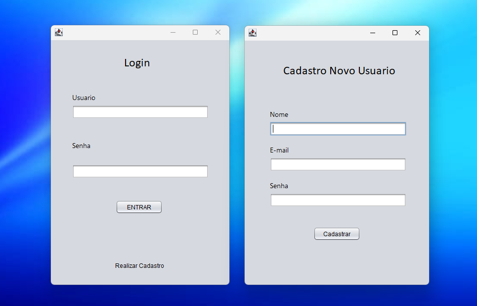

# Java Login System

Sistema desktop de login e cadastro de usuários, construído com Java e Swing, seguindo o padrão de arquitetura MVC (Model-View-Controller) e persistência de dados com JDBC.

Este projeto faz parte de um estudo focado em desenvolvimento Java, estruturado com atenção à organização de código, boas práticas e base sólida para futuros aprimoramentos.

## Visão Geral

O sistema permite que novos usuários sejam cadastrados e posteriormente façam login com validação no banco de dados. Ele possui uma interface gráfica feita em Swing, conectada a um banco PostgreSQL via JDBC.

## Tecnologias Utilizadas

- Java SE 17+
- Swing (interface gráfica)
- JDBC (conexão com banco de dados)
- PostgreSQL
- NetBeans (opcional)

## Estrutura do Projeto

src/
├── controller/
│   └── LoginController.java
├── dao/
│   └── LoginDAO.java
├── model/
│   └── LoginModel.java
├── util/
│   └── Conexao.java
└── view/
    ├── LoginView.java
    └── CadastroView.java

## Como Executar o Projeto

Pré-requisitos:
- JDK instalado (Java 17 ou superior recomendado)
- PostgreSQL rodando localmente
- IDE como NetBeans, IntelliJ ou Eclipse

### Passos:

1. Clone o repositório:
   git clone https://github.com/souzagabs/JavaLoginSystem.git

2. Importe o projeto na sua IDE

   Os arquivos `.form` são usados apenas para o editor visual de interfaces do NetBeans, mas não são obrigatórios para rodar o código.
   - **NetBeans**: abra o projeto normalmente.
   - **Outra IDE (IntelliJ, Eclipse, etc.)**: crie um novo projeto Java e copie os arquivos `.java` da pasta `src/`.
   - Os arquivos `.form` são opcionais (usados apenas no editor visual do NetBeans).

3. Configure o acesso ao banco

   Copie o arquivo `src/db.properties.example` para `src/db.properties`  
   e edite com os dados reais do seu PostgreSQL local (URL, usuário e senha).

   > O arquivo `db.properties` é carregado automaticamente pelo sistema e está fora do versionamento por segurança.

4. Crie o banco e a tabela executando o script `schema.sql` (raiz do projeto).

   Use uma ferramenta como DBeaver, pgAdmin ou qualquer IDE conectada ao PostgreSQL.

5. Execute a aplicação a partir de `LoginView.java`.

## Funcionalidades

- Tela de login com verificação de usuário/senha
- Tela de cadastro de novos usuários
- Conexão com banco de dados relacional
- Organização do código em camadas MVC

## Interface da Aplicação

Abaixo, a visualização da tela de login e cadastro:

## Melhorias Futuras

- Criptografia de senhas com BCrypt
- Validação de emails únicos no cadastro
- Tela de boas-vindas após login
- Possível migração para JavaFX ou Spring Boot

## Autor

Gabriel de Souza Brasil
Projeto desenvolvido como parte dos estudos em desenvolvimento Java.

## Licença

Este projeto está licenciado sob a licença MIT.
